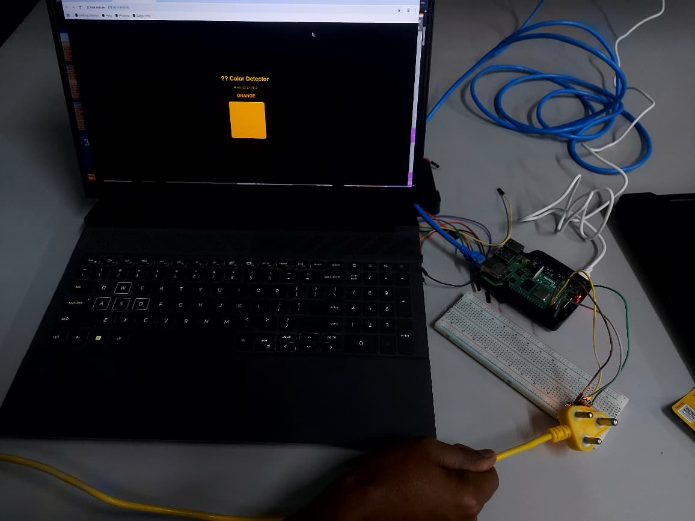
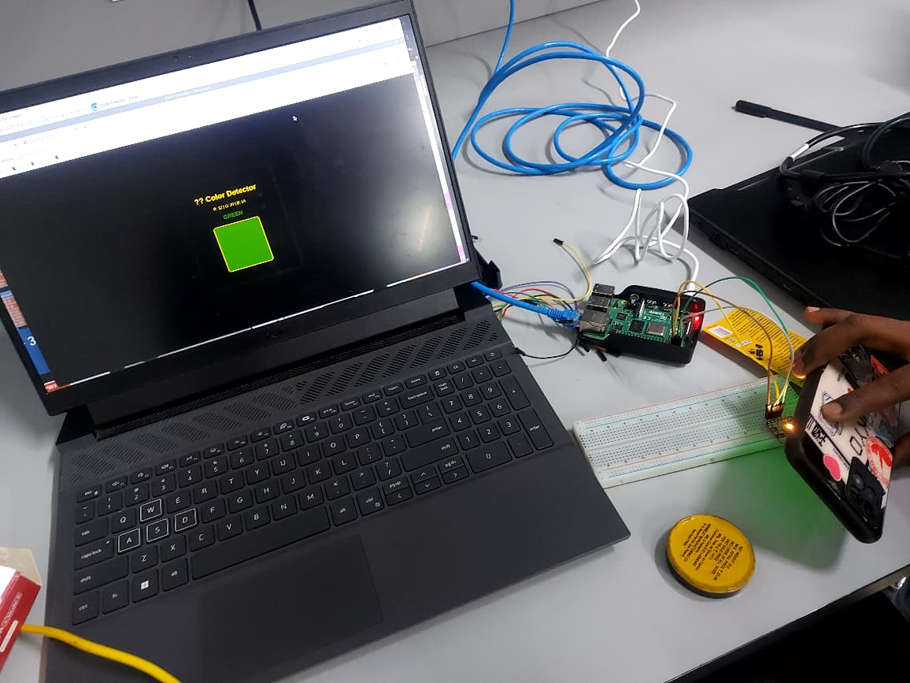
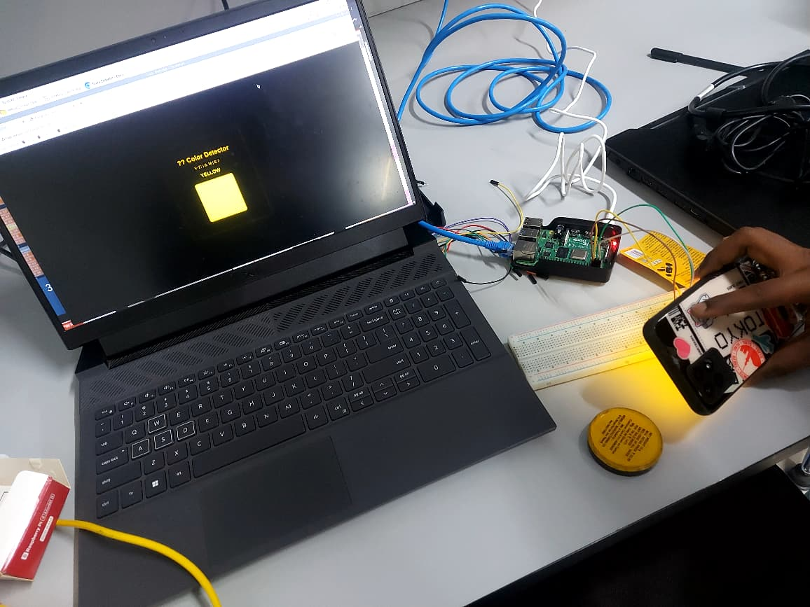
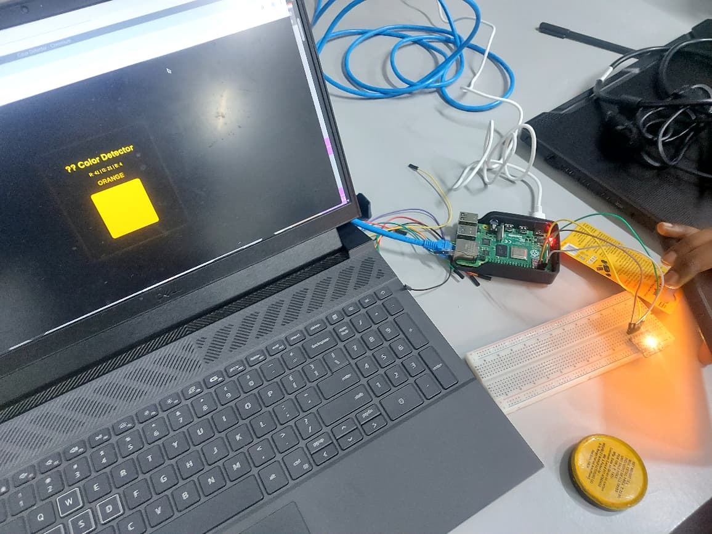
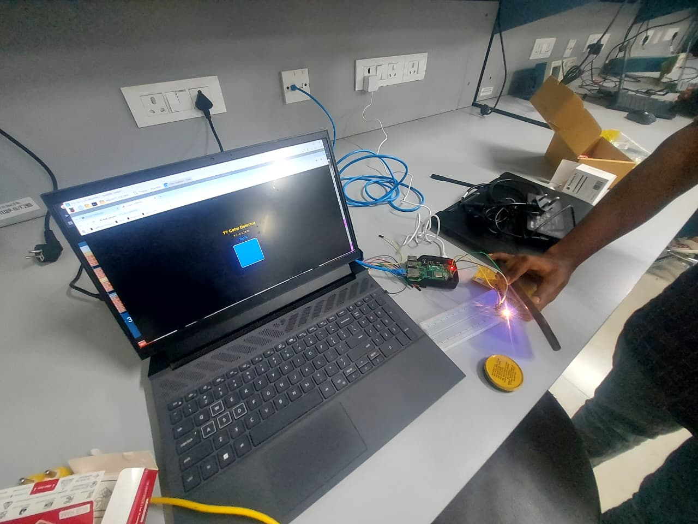

## 📌 Overview
This project implements a real-time color detection system using the TCS34725 sensor and Raspberry Pi. The system captures RGB values from objects, converts them into HSV format, and accurately identifies colors using hue-based classification. A Flask-based web interface is used to display the detected color dynamically.

## 🌟 Highlights
- ⚡ Real-time detection of object colors  
- 🎯 Accurate HSV-based classification algorithm  
- 🌐 Interactive Flask web interface for visualization  
- 🔌 Seamless I2C communication with sensor  
- 📊 Live display of RGB and detected color output  

> ✅ **Tested Successfully on Raspberry Pi Hardware**
## 📷 Output

### 🚀 Successfully Deployed on Raspberry Pi
